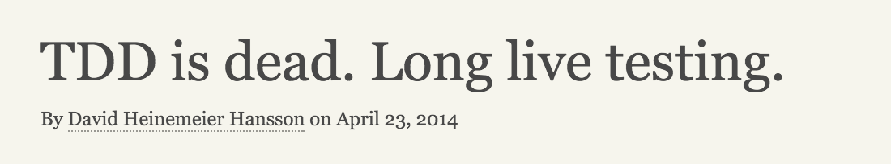
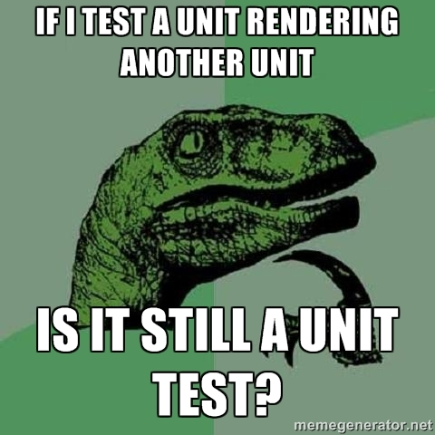

<!-- .slide: data-background="img/cover.png" -->


# About me

## Francesco Negri

## @dhinus

**Current job**: Senior Web Dev at BBC News Labs

**Current faves**: React, Docker, Clojure


# This talk is NOT about

Specific frameworks and tools

Why test runner X is better than test runner Y

How to make your code _"easier to test"_


# This talk IS about

The philosophy of automated testing

Unit testing vs Integration testing, TDD vs BDD

Mistakes I did and how to avoid them


# Things NOT to do

Mirror the code
```js
// Button.js
toggle: function (result) {
  return this[result ? 'enable' : 'disable']();
},
// ButtonSpec.js
it('() should call `#disable()`', function () {
    button.toggle();
    expect(button.disable).toHaveBeenCalled();
});
```

Test more than one thing at a time

Make tests interdependent


# Good things to do

Always make sure a test CAN FAIL

If you need to wait, use a fake clock

Make sure tests can run in parallel (no race conditions)

Coverage reports, CI, dashboard


# WHY tests?

Manual testing is boring

Tests are not making assumptions, so they can find bugs you thought impossible

Test coverage makes it safer to refactor & change components

Find regressions before your users do!

People reading your code will thank you


# Testing browser code in the console

## Close that browser!

Try writing browser code without _seeing_ it, with the help of tests

Focus on the business logic in your app without getting distracted by the visual
appearance


# TDD vs BDD

Is TDD dead?


Can I write unit tests in a behavioural style?

Should we just stop using these two acronyms?


# The pyramid of testing


Think of it as a continuum, not a dicotomy



Test the interface, not the implementation


# Mocks, stubs and other fowl(er)

Should I mock every dependency?

<!-- .slide: data-background="http://yesno.wtf/assets/no/12-dafd576be23d3768641340f76658ddfe.gif" -->
# NO

Chicago vs London styles

Choose your SUT


Mocking AJAX?

<!-- .slide: data-background="http://yesno.wtf/assets/maybe/0-16d0d74bfa3eb41e4d583375a475544d.gif" -->
# Maybe


# When to use Selenium

When you’ve tested a feature manually in your browser too many times

When you WISH you’d tested a feature manually at least once


# When to use Gherkin

When a BA can write it

When you need to define a contract between developers and the business


# Tooling
It actually makes a big difference...

...but it changes all the time

## Enzyme
https://github.com/airbnb/enzyme

## ava
https://github.com/sindresorhus/ava

## Nightwatch
http://nightwatchjs.org/

## docker-selenium
https://github.com/SeleniumHQ/docker-selenium


# Thanks
Questions?
